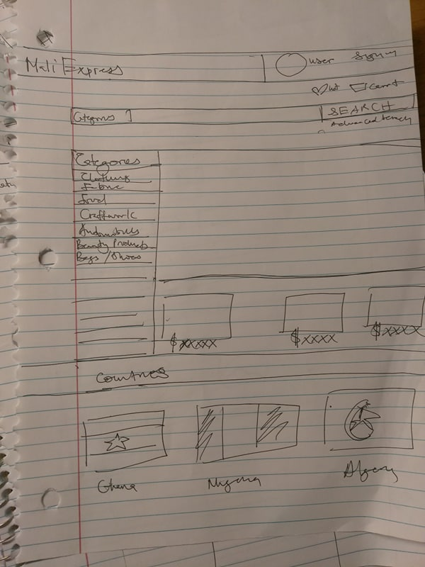
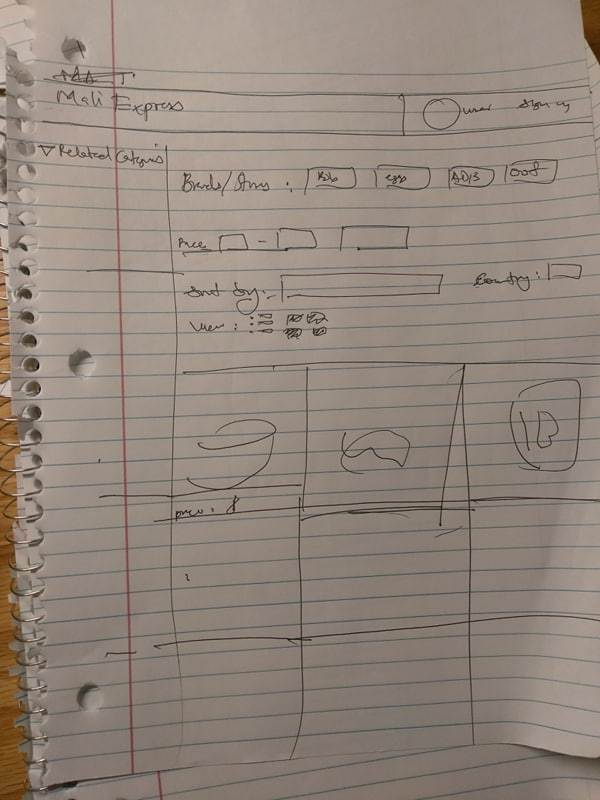

The content below is an example project proposal / requirements document. Replace the text below the lines marked "__TODO__" with details specific to your project. Remove the "TODO" lines.

(___TODO__: your project name_)

MaliExpress


## Overview

(___TODO__: a brief one or two paragraph, high-level description of your project_)

Creating a website that allows individuals to create their own online stores, and sell their own products.
All products can be found within a centralized market place that allows the user to search for the desired product he/she is looking for. Products are filtered based on what type of product it is,and what country it is being sold from.


## Data Model

(___TODO__: a description of your application's data and their relationships to each other_) 

The application will store Users, the stores they've created, and the products within those stores.
The stores will store the country they are made in.
The product objects will store the tags associated with them to allow for easy filtering.


(___TODO__: sample documents_)

An Example User:

```javascript
{
  username: "mansumusa",
  hash: // a password hash,
  stores: // an array of Stores
}
```

An Example Store:

```javascript
{
  user: // a reference to a User object
  name: "The Jewelry Jackpot",
  items: [
    { name: "Gold necklace", quantity: "9876", price: "$300", type: [ "Jewelry", "Gold", "Finished Product"]},
    { name: "Gold cup ", quantity: "2", type: ["Utensil", "Craftwork", "Gold"]},
  ],
  Location: "Mali"
}
```


## [Link to Commented First Draft Schema](db.js) 

(___TODO__: create a first draft of your Schemas in db.js and link to it_)

## Wireframes

(___TODO__: wireframes for all of the pages on your site; they can be as simple as photos of drawings or you can use a tool like Balsamiq, Omnigraffle, etc._)

/homepage - homepage of website



/products - page for showing all products



/store - page for showing a user's store


## Site map

(___TODO__: draw out a site map that shows how pages are related to each other_)

(documentation/Sitemap.jpg)

## User Stories or Use Cases

(___TODO__: write out how your application will be used through [user stories](http://en.wikipedia.org/wiki/User_story#Format) and / or [use cases](https://www.mongodb.com/download-center?jmp=docs&_ga=1.47552679.1838903181.1489282706#previous)_)

1. as non-registered user, I can register a new account with the site
2. as a user, I can log in to the site
3. as a user, I can create my own store
4. as a user, I can create product listings that I can sell ony my own store
5. as a user, the products I create on my store will be findable on the centralized marketplace
6. as a user, I can make transactions throughout my website
7. as a user, I can categorized my product listings anyway I like, and I can arrange how my store looks like under a template


## Research Topics

(___TODO__: the research topics that you're planning on working on along with their point values... and the total points of research topics listed_)

* (3 points) Add user templating
    * Allow user to create own page on website, and edit variables on chosen template to create their own page with their own product listings
* (3 points) Card transactions
    * Research some apis that allow users to make transactions either through paypal/venmo or a credit/debit card

6 points total out of 8 required points (___TODO__: addtional points will __not__ count for extra credit_)


## [Link to Initial Main Project File](app.js) 

[Main project file, app.js](src/app.js)

## Annotations / References Used

(___TODO__: list any tutorials/references/etc. that you've based your code off of_)

1. [passport.js authentication docs](http://passportjs.org/docs) - (add link to source code that was based on this)
2. [tutorial on vue.js](https://vuejs.org/v2/guide/) - (add link to source code that was based on this)
